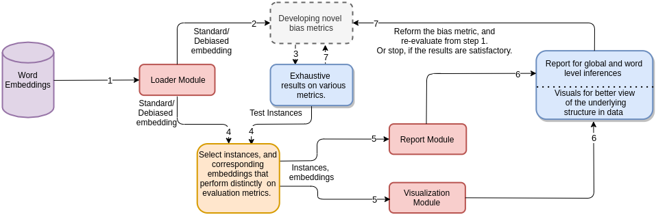
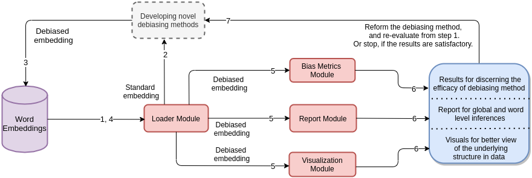

# Fair Embedding Engine
Fair Embedding Engine: A Library for Analyzing and Mitigating Gender Bias in Word Embeddings.


# Abstract
Non-contextual word embedding models have been shown to inherit human-like stereotypical biases of gender, race and religion from the training corpora. To counter this issue, a large body of research has emerged which aims to mitigate these biases while keeping the syntactic and semantic utility of embeddings intact. This paper describes Fair Embedding Engine (FEE), a library for analysing and mitigating gender bias in word embeddings. FEE combines various state of the art techniques for quantifying, visualising and mitigating gender bias in word embeddings under a standard abstraction. FEE will aid practitioners in fast track analysis of existing debiasing methods on their embedding models. Further, it will also allow rapid prototyping of new methods by evaluating their performance on a suite of standard metrics. 

# Modules
 The core functionality of FEE is governed by five modules, namely *Loader*, *Debias*, *Bias Metrics*, *Visualization*, and *Report*. 

 ```
 .
 |-debias
 | |-ran_debias.py
 | |-hard_debias.py
 | |-hsr_debias.py
 | |-__init__.py
 |-embedding
 | |-loader.py
 | |-__init__.py
 |-utils.py
 |-reports
 | |-word_report.py
 | |-global_report.py
 | |-biased_neighbours.py
 | |-__init__.py
 |-metrics
 | |-weat.py
 | |-sembias.py
 | |-proximity_bias.py
 | |-pmn.py
 | |-gipe.py
 | |-direct_bias.py
 | |-indirect_bias.py
 | |-__init__.py
 |-__init__.py
 |-visualize
 | |-neighbour_bias_wordcloud.py
 | |-neighbour_plot.py
 | |-gender_cluster_tsne.py
 | |-pca_components.py
 | |-__init__.py
```

# Role of FEE in propagating research in fairness.



# Requirements
```
numpy
pandas
matplotlib
tqdm
torch
wordcloud
sklearn
```

# Documentation
The official documentation (WIP) is hosted on [ReadTheDocs.](https://fair-embedding-engine.readthedocs.io/en/latest/)


# Conclusion
In this work, we described Fair Embedding Engine (FEE), a python library which provides central access to the state-of-the-art  techniques for quantifying, mitigating and visualizing gender bias in non-contextual word embedding models. We believe that FEE will facilitate the development and testing of debiasing methods for word embeddings models and also make it easier visualize the bias present in word vectors, demonstarting their possible impact. In future, we would like to expand the capabilities of FEE towards contextual word vectors and also provide support towards biases other than gender and language other than English.
