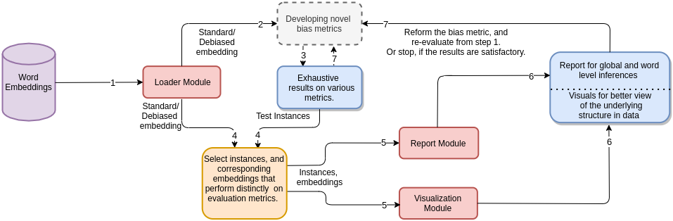

.. rst-class:: hide-header

Welcome to FEE -- Fair Embedding Engine's documentation!
========================================================
Fair Embedding Engine: A Library for Analyzing and Mitigating Gender 
Bias in Word Embeddings.

Non-contextual word embedding models have been shown to inherit 
human-like stereotypical biases of gender, race and religion from the 
training corpora. To counter this issue, a large body of research has 
emerged which aims to mitigate these biases while keeping the syntactic 
and semantic utility of embeddings intact. This paper describes Fair 
Embedding Engine (FEE), a library for analysing and mitigating gender 
bias in word embeddings. FEE combines various state of the art 
techniques for quantifying, visualising and mitigating gender bias in 
word embeddings under a standard abstraction. FEE will aid practitioners 
in fast track analysis of existing debiasing methods on their embedding 
models. Further, it will also allow rapid prototyping of new methods by 
evaluating their performance on a suite of standard metrics.

Role of FEE in propagating research in fairness
========================================================
Despite the development of a large number of debiasing methods, the issue 
of bias in word representations still persists, making it an active area 
of research. We believe that the design and wide variety of tools provided 
by FEE can play a significant role in assisting practitioners and researchers 
to develop better debiasing and evaluation methods. 
The following figures portrays FEE assisted workflows which abstract the 
routing engineering tasks and allow users to invest more time on the 
intellectually demanding questions. 

.. image:: ../../assets/dev2.png

FEE serves as a centralized resource for practitioners and researchers to 
develop novel debiasing methods and bias evaluation metrics. 
Figures illustrate the possible workflow associated with each of the 
tasks respectively all made possible by the powerful abstraction provided by FEE.

.. toctree::
   :maxdepth: 2
   :caption: Contents:

Documentations
=========================
Following are the documentations for the constituent classes in the five 
major components of FEE -- Loader, Debiasing, Reports, Metrics and 
Visualizations.

Loader
=========================
.. automodule:: fee.embedding.loader
   :members:

Debiasing
=========================   
.. automodule:: fee.debias.hard_debias
   :members: 
.. automodule:: fee.debias.hsr_debias
   :members: 
.. automodule:: fee.debias.ran_debias
   :members: 

Reports
=========================   
.. automodule:: fee.reports.biased_neighbours
   :members: 
.. automodule:: fee.reports.word_report
   :members: 
.. automodule:: fee.reports.global_report
   :members: 

Metrics
=========================   
.. automodule:: fee.metrics.weat
   :members: 
.. automodule:: fee.metrics.sembias
   :members: 
.. automodule:: fee.metrics.proximity_bias
   :members: 
.. automodule:: fee.metrics.pmn
   :members: 
.. automodule:: fee.metrics.gipe
   :members:             
.. automodule:: fee.metrics.direct_bias
   :members:   
.. automodule:: fee.metrics.indirect_bias
   :members:         

Visualizations
=========================   
.. automodule:: fee.visualize.neighbour_bias_wordcloud
   :members: 
.. automodule:: fee.visualize.neighbour_plot
   :members: 
.. automodule:: fee.visualize.gender_cluster_tsne
   :members: 
.. automodule:: fee.visualize.pca_components
   :members:       

Indices and tables
==================

* :ref:`genindex`
* :ref:`modindex`
* :ref:`search`
